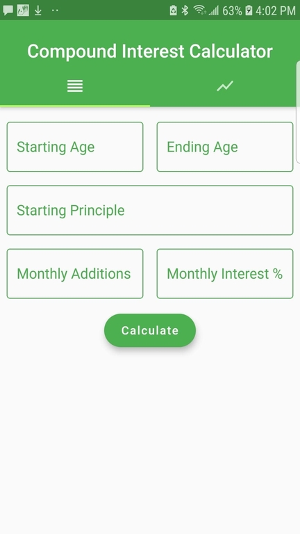
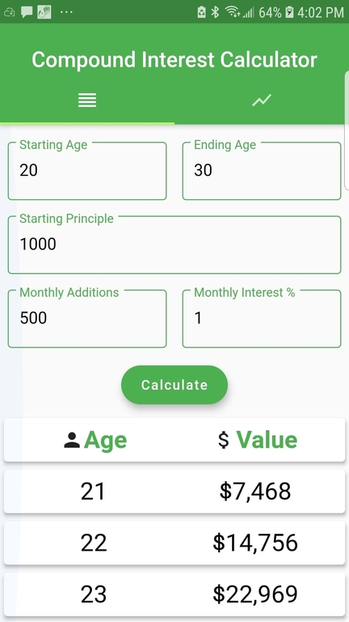
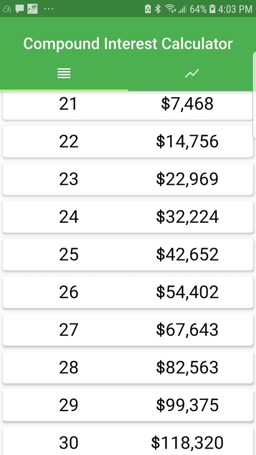
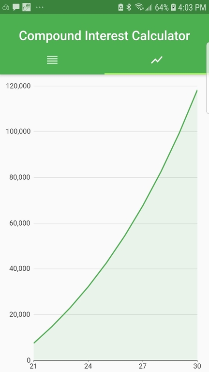
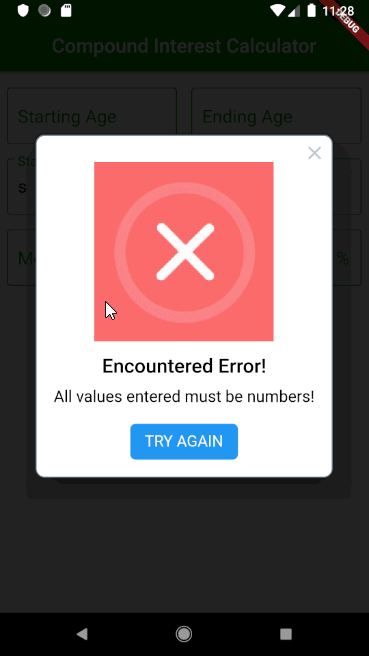

# Compound Interest Calculator
Welcome to my first mobile app made using Flutter!
The purpose of this application is to visualize the growth of an investment portfolio by year, compounded monthly.

## Getting Started  
### **Step 1:** Fill in entry fields with corresponding values.  

  

### **Step 2:** Press Calculate and see results!  

  

### **If Values Are Not Integers:**  
And error pops up!  
  